# 概览

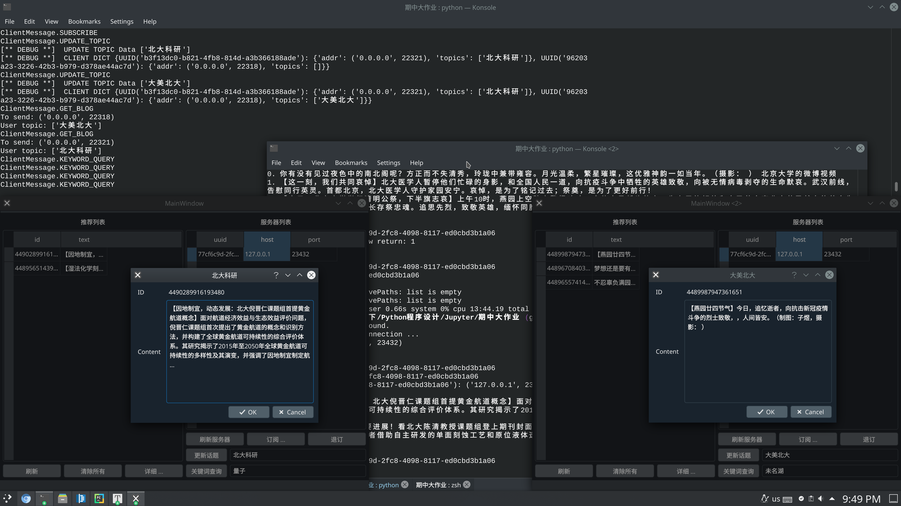

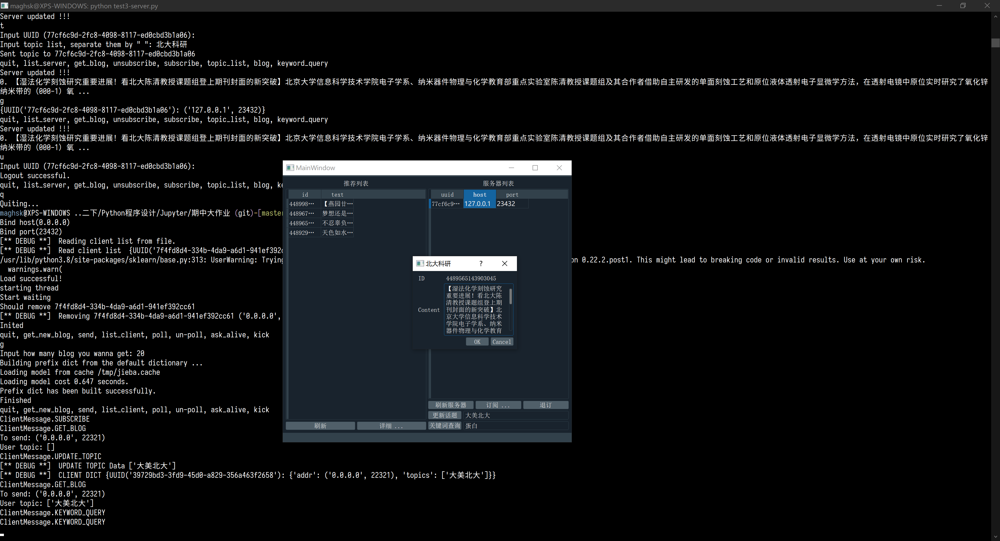

实现了第一至第四模块的基本要求+进阶要求。

接下来我会依次介绍各模块实现明细。

# 测试环境

因为本次作业用到了socket通信，相比与Windows操作系统，Linux下的socket编程开发实现更利于演示。所以请在 Linux 下使用 Windows Subsystem on Linux 测试我的代码。

我的测试环境：

```screenfetch
                   -`                 
                  .o+`                 maghsk@HYD-XPS-9570
                 `ooo/                 OS: Arch Linux 
                `+oooo:                Kernel: x86_64 Linux 5.5.13-arch2-1
               `+oooooo:               Uptime: 2h 39m
               -+oooooo+:              Packages: 1370
             `/:-:++oooo+:             Shell: zsh 5.8
            `/++++/+++++++:            Resolution: 3840x2160
           `/++++++++++++++:           DE: KDE 5.68.0 / Plasma 5.18.4
          `/+++ooooooooooooo/`         WM: KWin
         ./ooosssso++osssssso+`        GTK Theme: Breeze [GTK2/3]
        .oossssso-````/ossssss+`       Icon Theme: Papirus-Dark
       -osssssso.      :ssssssso.      Disk: 192G / 1.2T (17%)
      :osssssss/        osssso+++.     CPU: Intel Core i7-8750H @ 12x 4.1GHz [71.0°C]
     /ossssssss/        +ssssooo/-     GPU: Intel Corporation UHD Graphics 630 (Mobile)
   `/ossssso+/:-        -:/+osssso+-   RAM: 7165MiB / 15633MiB
  `+sso+:-`                 `.-/+oso: 
 `++:.                           `-/+/
 .`                                 `/

```

# 模块一

## 特点

### 基本要求

- 能够爬取信息
- 能够提取所需内容

### 进阶要求

- **可以爬取评论**

  - 只需将 `CRAW_COMMENTS` 设置为真即可。

  - 实现方式为：向 `https://m.weibo.cn/api/comments/show` 发出 `url` 中包含请求内容的请求。如下所示：

  - ```python
    comment_params = {
        'id': blog_id,
        'page': 1
    }
    comment_base_url = 'https://m.weibo.cn/api/comments/show?'
    cgetter = PageGetter(comment_base_url, self.headers, comment_params, do_page_pickle=False, sleep_every_craw=SLEEP_EVERY_CRAW)
    ```

### 其他特性

- **自动在每次获取新页面时休眠随机时长，防止反爬虫**

- 在爬取函数内使用 `yield` 关键字，便于调用与封装

- 实现对**微博时间格式**的统一管理（ISO日期格式）

  - 这部分我使用的正则表达式处理，具体匹配了四种模式：

  - ```python
    HOUR = u'^([0-9]+).*小时前$'
    YEST = u'^昨天.*$'
    MD = '^([0-9]+)-([0-9]+)$'
    YMD = '^([0-9]+)-([0-9]+)-([0-9]+)$'
    ```

  - 对于上述四种模式之外的时间格式，视为今天（一般为“刚刚”等）

## 运行时说明

直接运行 `part1.py` 即可，爬取的微博默认保存在 `./weibo_pkl`。下面是常量表：

```python
DO_PAGE_PICKLE = False                  # 是否保留每次抓取的页面（本地测试可加快速度）
PAGE_PICKLE_DIR = './page_pkl'          # 抓取页面保存路径

DO_MBLOG_PICKLE = True                  # 是否保存每条微博（**基础要求**）
MBLOG_PICKLE_DIR = './weibo_pkl'        # 每条微博保存路径

CRAW_COMMENTS = True                    # 是否爬取评论（**进阶要求**）
STOP_WORDS_PATH = './stopword.txt'      # TF-IDF 分析中停表的路径

SLEEP_EVERY_CRAW = 3                    # 每次爬取新页面，暂停的时长
```

`Crawler` 类为爬虫类，在初始化时自动爬取微博。可以指定爬取数目。

为了去除重复微博和之后的模块相互协调，保存的 `dict` 中会含有微博 id 信息。此外再爬取评论时，遇到了评论中含有图片的情况，对于这种情况，我选择**保留图片超链接**，这样便于后续 GUI 显示。以下是我爬取的一个例子：

```json
{
    "tag": [
        "清明",
        "愿山河无恙"
    ],
    "id": 4489987947361651,
    "text": "【燕园廿四节气】今日，追忆逝者，向抗击新冠疫情斗争的烈士致敬，，人间皆安。（制图：子煜，摄影： ）",
    "time": "2020-04-04",
    "comment": 17,
    "forward": 12,
    "like": 412,
    "other": [
        "逝者安息，缅怀英雄<span class=\"url-icon\"></span>"
    ],
    "keyword": [
        "廿四",
        "新冠",
        "子煜",
        "逝者",
        "燕园",
        "追忆",
        "节气",
        "致敬"
    ]
}
```

附上调用方式：

```python
craw = Crawler(10, myid=1800013097, nowtime=datetime.date.today().strftime('%Y%m%d'), craw_comments=CRAW_COMMENTS)
with open('weibos.json', 'w', encoding='utf-8') as fp:
    json.dump(craw.info, fp, ensure_ascii=False)
    if DO_MBLOG_PICKLE:
        craw.saveWeibo(MBLOG_PICKLE_DIR)
```


# 模块二

## 特点

### 基本功能

- **新闻主题分类**

  - 我爬取了 1000 条的微博，然后限定对于四个种类，每种微博的文章数目上限为 100 条，然后将其对半分为测试集和训练集，每种集合的每种分类**至多**50条数据，然后用TF-IDF模型进行特征提取，使用朴素贝叶斯分类模型进行训练，训练完毕后保存了模型。

  - 因为爬取的微博可能含有多种分类，所以在训练时我随机的选取了其中之一作为分类。

  - 因为爬取的微博自带分类，所以在测试时我选择了忽略掉这些分类信息，`part2.py` 中 `NewBlog.get()` 函数内有如下代码：

  - ```python
   mblog_info_list[idx]['tag'] = [self.dictionary[pred]]
     ```
  
  - 在我的实例中，四种分类的训练集大小分别为：
  
     | 类别名称     | 样本数 |
     | ------------ | ------ |
  | 北大科研     | 50     |
     | 高校学堂计划 | 38     |
     | 大美北大     | 36     |
     | 其他         | 50     |
  
  - 测试集预测结果如下（下表第 $i$ 行 $j$ 列的数字的含义为：对于测试集，标签为 $i$ 的样本，使用我的模型预测的标签为 $j$. 准确率为 $83\%$）：
  
  $$
  \left[
     \begin{matrix}
     50&  0&  0&  0 \\
      1& 36&  0&  1 \\
     0&  0& 27&  9 \\
    11&  3&  4& 32 \\
    \end{matrix}
    \right]
  $$
  

### 进阶功能

- **关键词检索**
  - 用户可以输入关键词列表，可以将其以 `list` 的形式传递给函数 `keyword_query_str`，随后该函数将返回一个分类，表示预测关键词可能属于的分类。
  - 对于该需求的实现，我是将关键词列表视为一次片完整的微博，然后使用微博分类器进行分类的。
  - 朴素的 TFIDF 模型可能无法对不在训练集中的单词给出分类，为此，我使用“**最小编辑距离**”的算法，求出用户输入不在训练关键词内的那些关键词，最“相似”的训练关键词。然后输入我们的模型中，**也可以返回分类结果**。但是这么做势必会带来精确度的牺牲，不过我们获得了用户体验。那些不在训练关键词库中的查询，我们会对其进行反馈。反馈形如：`蛋白酶 not found, use 蛋白酶体 for alternative.`，表示用户输入的关键词“蛋白酶”不在关键词表中，用“蛋白”代替了用户的输入然后进行的查询。

### 亮点

预测不在训练样本词库中的单词的分类（上文提到）。

## 运行时说明

保存的模型文件名为 `nlp-classifier.model`

直接运行 `part2.py` 即可。一次成功的运行结果可能如下所示：

```
[50, 38, 36, 50]
Finished training!
[[50.  0.  0.  0.]
 [ 1. 36.  0.  1.]
 [ 0.  0. 27.  9.]
 [11.  3.  4. 32.]]
Acc: 0.8333333333333334
Load successful!
Input: ['科研']
Output: 高校学堂计划
Input: ['燕园']
Output: 大美北大
Input: ['欧洲']
Output: 其他
Input: ['量子']
Output: 北大科研
Input: ['蛋白酶']
蛋白酶 not found, use 蛋白酶体 for alternative.
Output: 高校学堂计划

Process finished with exit code 0
```

下表为运行常量：

```python
MIN_TRAIN_FILES = 20            # 训练所需最少文件数
MIN_TRAIN_SIZE = 100            # 每个tag训练所需最少文章数
```

附上调用方式：

```python
nblog = NewBlog('./nlp-classifier.model', MBLOG_PICKLE_DIR, train_now=True)
nblog.trainer.load_model()
for lst in [['科研'], ['燕园'], ['欧洲'], ['量子'], ['量子位'], ['蛋白酶']]:
    print('Input:', lst)
    print('Output:', nblog.keyword_query_str(lst))
```


# 模块三

我将此部分分为了三个源文件：`part3.py`, `weibo.py`, `user.py`，和两个测试文件：`test3-client.py`, `test3-server.py`。

服务器类：`WeiBo` 在 `weibo.py` 中。

客户端类：`User` 在 `user.py` 中。

`part3.py` 中为一些常量。

## 代码运行

- 直接运行`test3-server.py`，敲击两次回车之后服务器开始监听。

- 然后直接运行 `test3-client.py` 敲击两次回车后，键入 `s` 然后再敲击两次回车（此时已订阅服务器），键入 `t` 敲击一次回车再敲击一次回车，输入 `大美北大` （或其他话题）再敲击回车
- 服务器窗口输入 `g` 然后回车，会提示输入爬取微博数目，输入爬取的数目之后回车（建议20，默认为8），然后输入 `s` 表示向所有客户端发送更新的微博，此时客户端应该可以收到数据
- 客户端输入 `k` 然后根据提示输入要查询的关键字，即可完成关键字查询

服务器和客户端都可以通过键入 `l` 来列出服务器或客户端列表：


## 特点

实现基本+进阶要求的同时，引入了UUID，便于服务器管理客户端、客户端维护服务器。

## 实现结果

### 服务器

我制作了一个建议的 CUI 方便测试程序 `test3-server.py`。CUI 将会开启双线程来协调后台与前台用户的输入。此部分运算较小，所以没有必要开多进程。

我认为作为一个广播服务器，负载最大的部分发生在向所有订阅的用户广播这个过程中。所以广播函数我使用了多进程加速。

调用方式都在 `test3-server.py` 的 `main` 中。

使用了 `{client uuid: (client address pair, client topic)}` 的方式管理客户端列表在 `Weibo.client_dict` 中。

服务器可以：

- 爬取最新微博：`get new blog`
- 接受用户注册（默认允许注册，也可以设置为不接受任何注册）。
- 推送微博到订阅用户：`send`，这里使用了多进程，首先主进程 `fork` 建立进程池（我设置为4进程），然后将所有用户的列表作为输入，放入进程池中，进程池会对列表中的每个用户执行发送操作。进程池处理完毕后将进程池中的进程回收。
  - 直接调用 `WeiBo.send()`
- **定期爬取更新微博**：`poll`，服务器定期从北大官方微博爬取数据，并将爬到的数据发送给所有订阅用户。实现方式为**轮询**，可自定义轮询间隔。实现**定期向用户推送热点新闻**。
  - 调用方式：`WeiBo.server_poll(POLL_NUM)`
  - `POLL_NUM` 含义为每次轮询爬取的数量。
  - 这部分实现我利用了多线程实现，与其他操作并发，可以做到轮询不影响其余操作
- 取消定期爬取微博：`un-poll`
- **踢出订阅的用户**：`kick`，把用户踢出用户列表 :D
  - `WeiBo.kick(client_uuid)`
- 嗅探所有用户列表中的用户是否可连接：`ask alive`，简单的基于 ip、端口号的检测。单纯检查可不可以 `connect` 到目标端口，对于不活跃的客户端，我们会将其从客户列表移除。
  - `WeiBo.alive_check()`

### 客户端

我制作了一个建议的 CUI 方便测试程序 `test3-client.py`。CUI 将会开启双线程来协调后台与前台用户的输入。此部分运算较小，所以没有必要开多进程。

客户端既可以被动等待服务器推送数据[@fig:bd]，又可以主动向服务器发送请求[@fig:zd]：

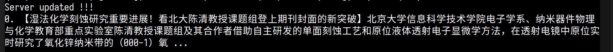{#fig:bd}

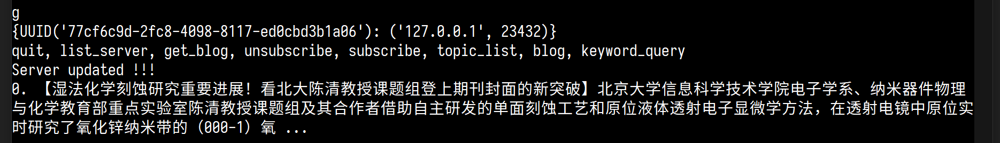{#fig:zd}

**主动发起请求**的实现为：客户端向服务器发送主动请求信息，因为 `socket` 无法全双工，所以服务器接到消息后会立即向客户端监听端口推送最新消息（相当于在服务器端执行单用户的发送）。这样客户端会接收到服务器推送的信息，主动请求的功能就完成了。所以为了主动请求成功，必须要在服务器端执行爬取微博的操作，设计上不允许客户端主动要求服务器爬取微博，不然服务器可能在短时间内接到大量的爬取微博的信息，导致负载过大。

客户端也可以**主动更新兴趣 `tag` 列表**，实现的方式为，客户端主动向服务器发起更改 `tag` 请求，服务器接到请求后，会向服务器接受一个 `list`，里面的信息就是感兴趣的列表，然后服务器更新客户端数据记录。结束。

下面是客户端功能展示。

#### 功能展示

客户端功能与模块四中图形界面中的功能相同，我认为GUI来展示功能的方式更为直观，所以给出GUI的样子，如下图所示：

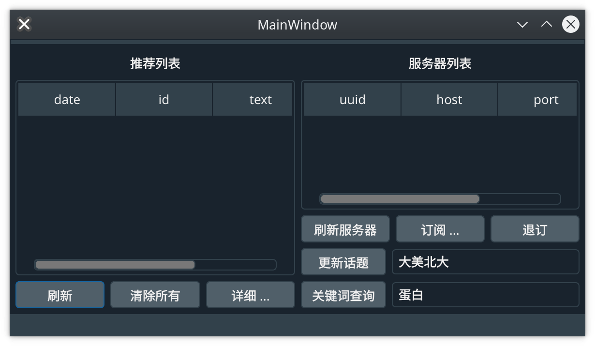

客户端可以：

- 订阅服务器 `subscribe`：初始订阅时不包含任何感兴趣的话题
  - 调用入口：`User.register((host, port))`
- **更新感兴趣的话题** `topic`：向服务器发送自己感兴趣的话题“更新话题”
  - 调用入口：`User.send_topic_list(server_uuid: uuid.UUID, topics: list)`
  - **输入时以空格分隔话题**
- 退订服务器 `unsubscribe`
- **关键词查询** `keyword query`：以向服务器发送自己输入的关键词的方式获取微博 
  - 调用入口为 `User.keyword_query(server_uuid, keyword_list: list)`
  - **输入时以空格分隔关键词**
- **主动向服务器请求更新** `get blog (positive)`
  - 模拟我们下拉手机微博的操作：即向服务器主动发起请求，获取数据[@fig:zhudong]。
  - 调用入口为 `User.positive_ask_blog()`

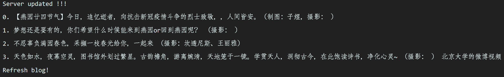{#fig:zhudong}

## 截图

下图[@fig:shuang]为两个客户端运行效果图，第一个客户端（左侧）关注的话题是“北大科研”，查询的关键词是“量子”；第二个客户端（右侧）关注的话题是“大美北大”，查询的关键词是“未名湖”；上侧终端是服务器端控制台输出。

{#fig:shuang}

# 模块四

使用 `PyQt5` 实现了基本+扩展功能。

`PyQt5` 环境信息：

```python
PYQT_VERSION = 329986
PYQT_VERSION_STR = '5.9.2'
QT_VERSION = 329991
QT_VERSION_STR = '5.9.7'
```

直接运行 `part4.py` 即可。

**左侧微博列表可以显示微博更新时间！（刚刚添加的功能，可能有些截图没有更新）**


为了实现和服务器联动，请按照模块三中的说明启动服务器（运行 `test3-server.py` ，然后敲击两次回车绑定默认端口！！）

## 特点

- 使用 Qt 框架，拥有强大的社区支持

- 使用 `.ui` 文件，方便修改、二次开发窗口的布局

  - 包含主窗口 `form.ui` 和会话窗口 `blogDialog.ui` 布局，可以使用 `pyuic5` 生成相应的 `Python` 源代码

  - ```bash
    pyuic5 form.ui -o form.py
    pyuic5 blogDialog.ui -o blogDialog.py
    ```

- 引入“清除所有”按钮，方便使用 [@fig:qingchu]→按下 `Yes`→[@fig:querenqingchu]

  - （因为这个功能是后来加的，所以可能除了下面两张截图外，别的截图中都没有这个按钮）

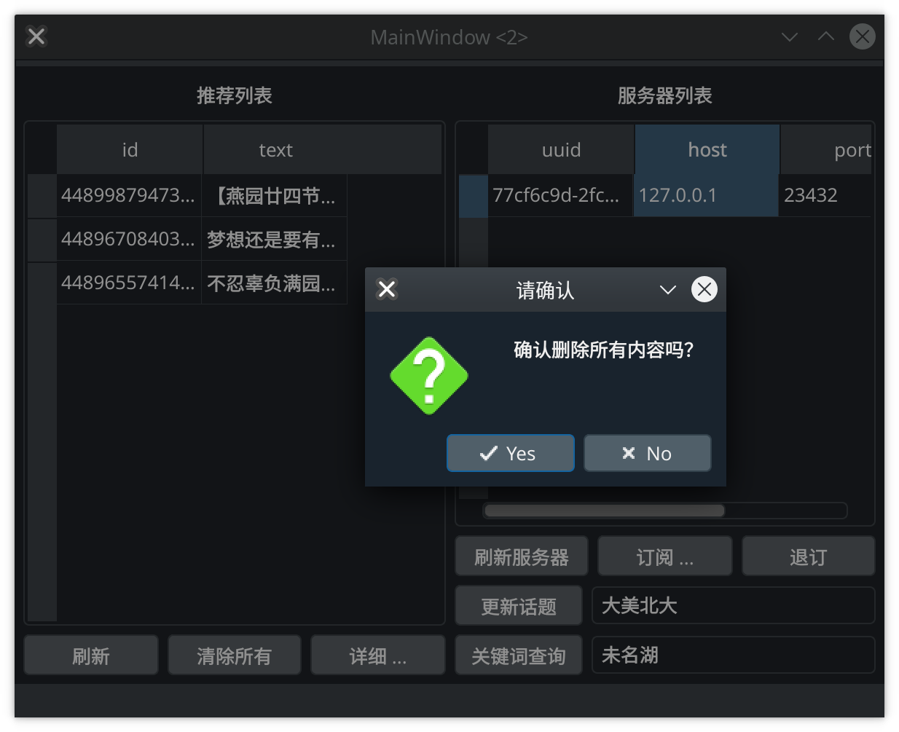{#fig:qingchu width=68%}

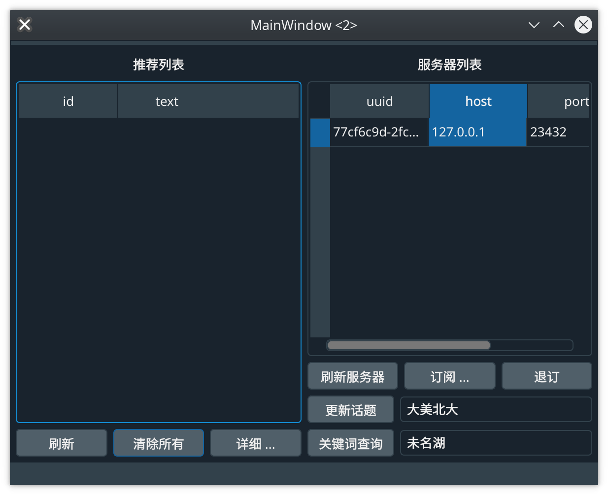{#fig:querenqingchu width=68%}


## 运行时

启动时会分别弹出两个对话框要求用户输入绑定的端口号和地址（有默认值）。

启动起来之后如下图：

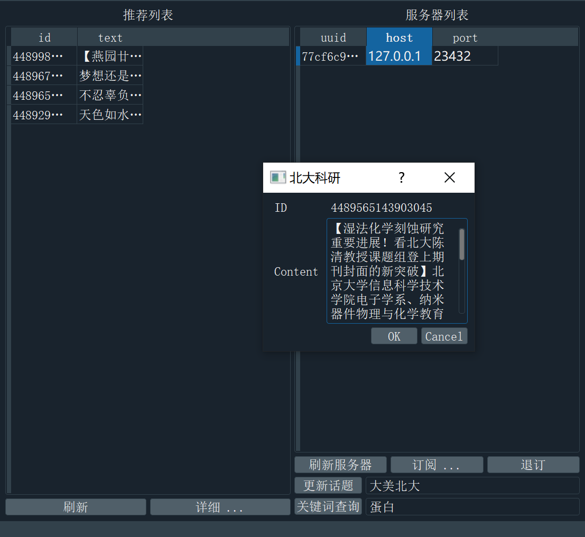{width=68%}

左侧为微博列表，右侧为服务器列表。

用户可以点击订阅，然后输入服务器地址和端口号（默认为 `test3-server.py` 的默认信息），点击确定后，服务器列表中会出现一个项目。

选中推荐列表中的微博，然后点击“详细...” 可以弹出一个对话框浏览全文内容，如果更改了内容，然后点ok则会保存，更新微博：

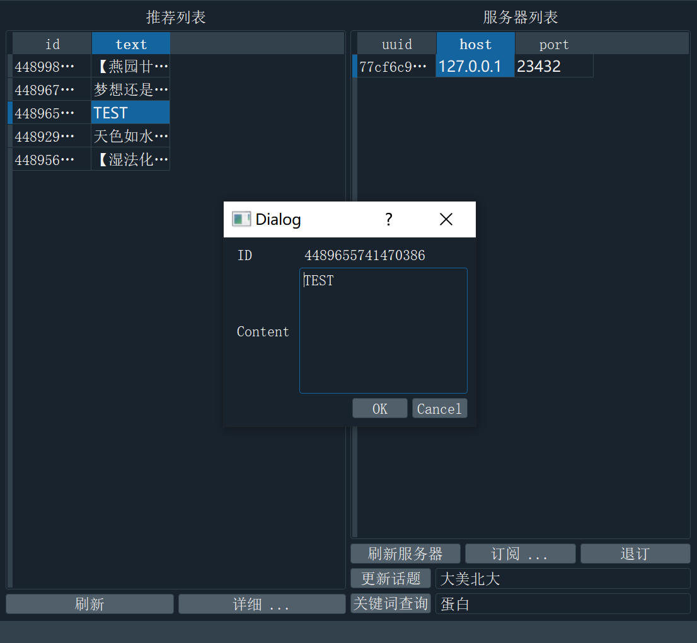{width=68%}

- **选中**服务器列表中的服务器，然后输入更新话题按钮右侧的文本，**输入时以空格分隔关键词**，再点击更新话题，可以向服务器发送用户喜欢的话题。
- **选中**服务器列表中的服务器，然后输入关键词查询按钮右侧的文本，**输入时以空格分隔关键词**，再点击关键词查询，可以向服务器发送请求，服务器会通过输入的关键词，返回一篇微博。

如果通过关键词查询，查询到了服务器端有一篇符合要求的博文，会得到如下反馈，可以看到查询“蛋白”的分类已经体现在了弹出窗口的标题中：

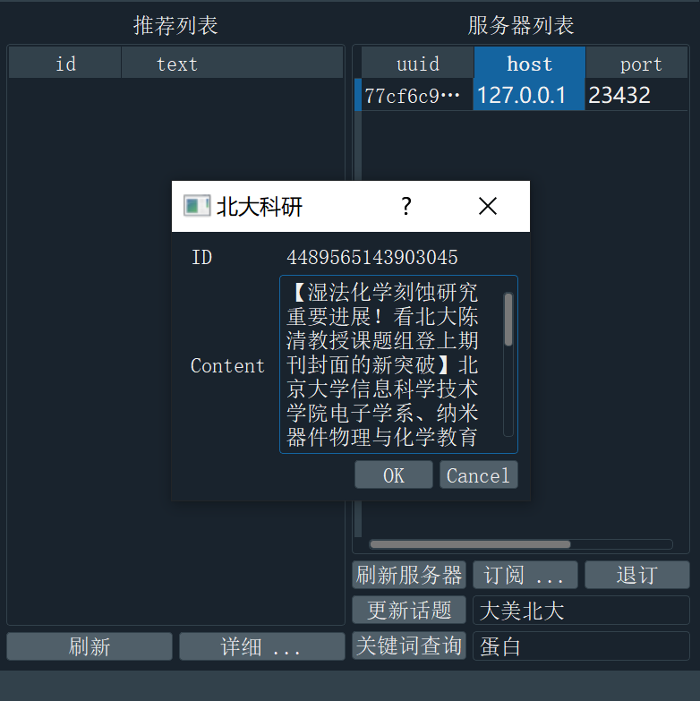{width=68%}

此时如果我们点击 `OK` 则会保存这条微博到推荐列表：

{width=68%}

如果 `Cancel` 被点击，则不会保存。

如果我们更改了其中的内容，则会保存更改之后的文本（[@fig:ggbcy]、[@fig:ggbct]）：

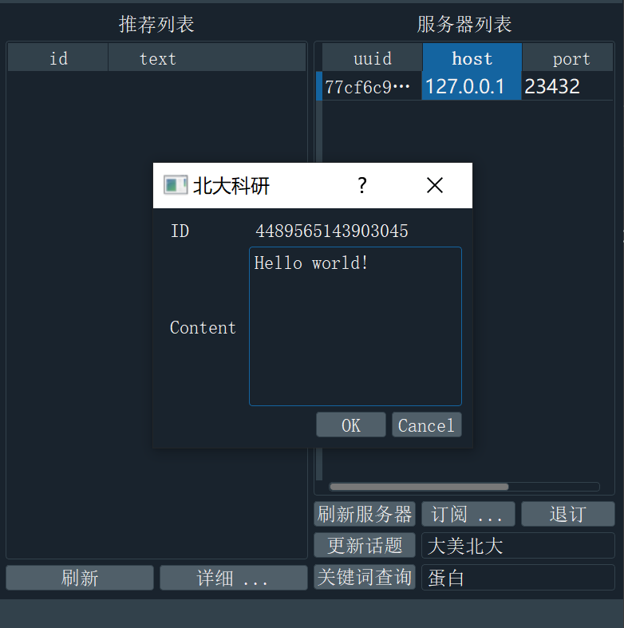{#fig:ggbcy width=68%}

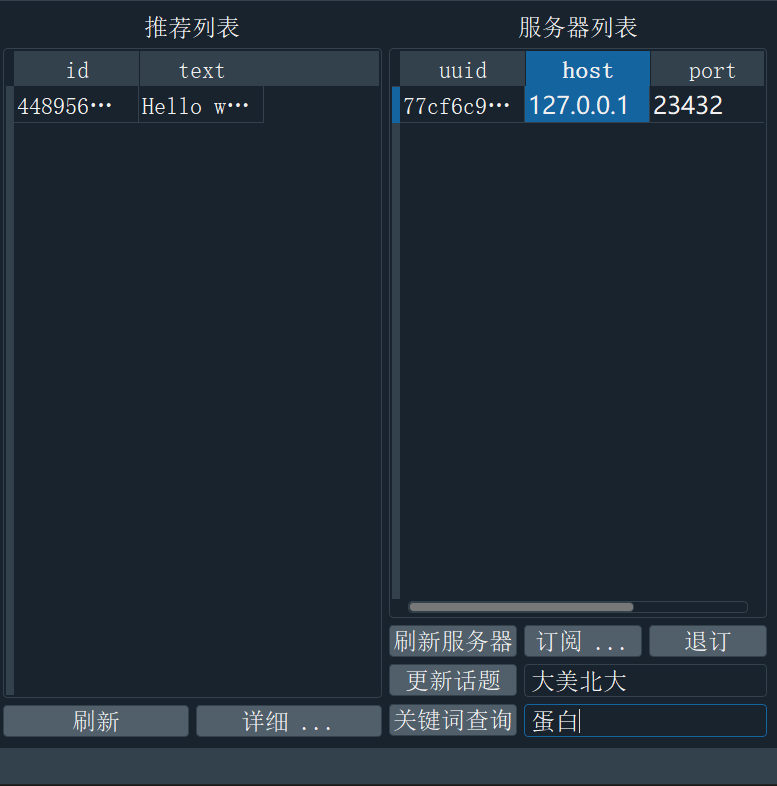{#fig:ggbct width=68%}

此外点击刷新按钮可以模拟我们下拉微博的操作：即向服务器主动发送更新微博的请求（[@fig:zdqq]）（主动请求成功之前，必须要在服务器端执行爬取微博的操作）。

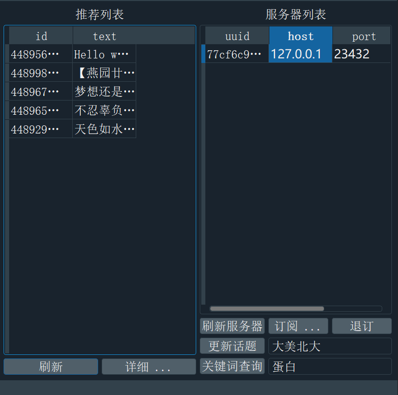{#fig:zdqq width=68%}
